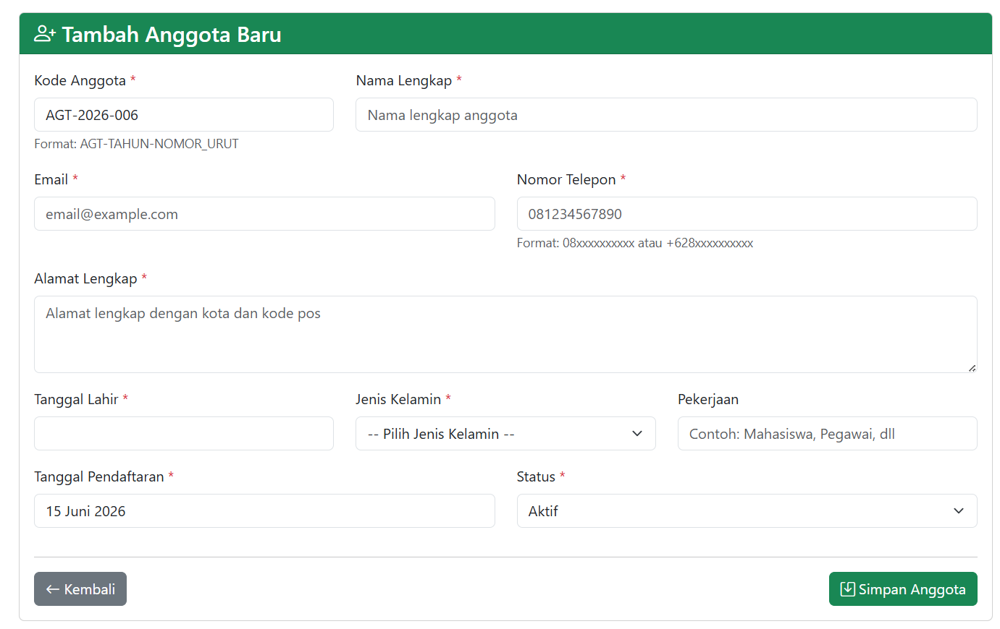
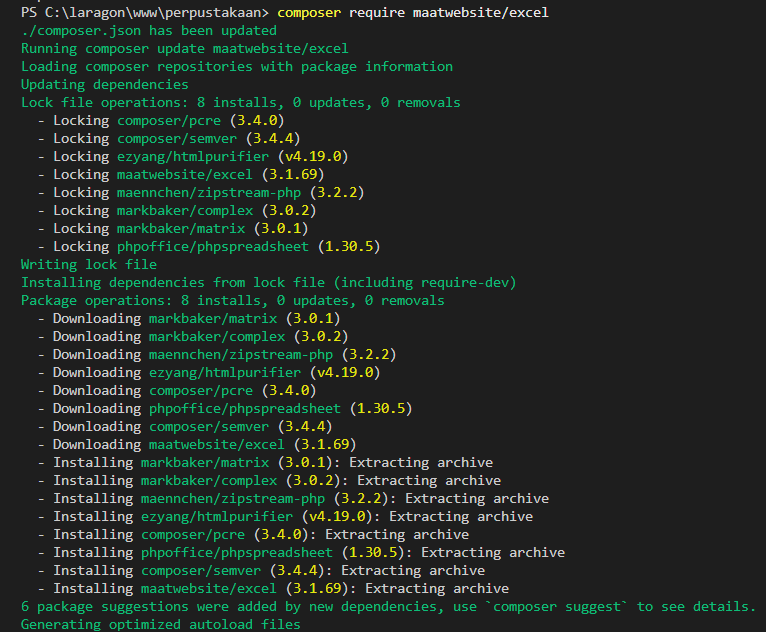
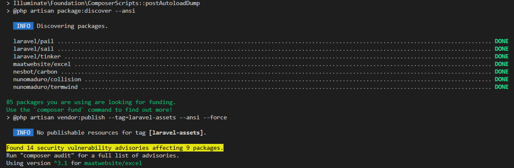
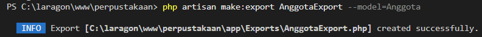
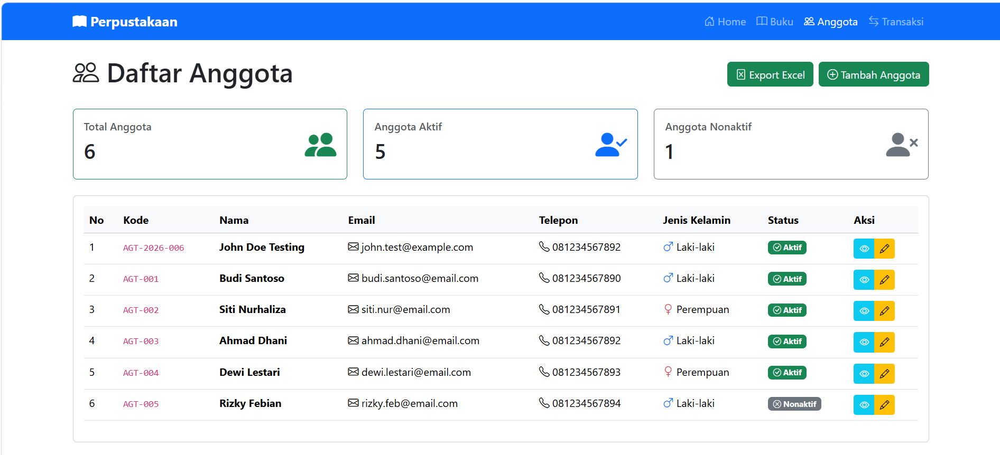
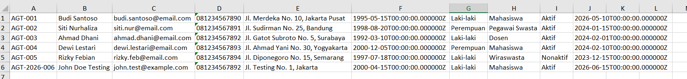
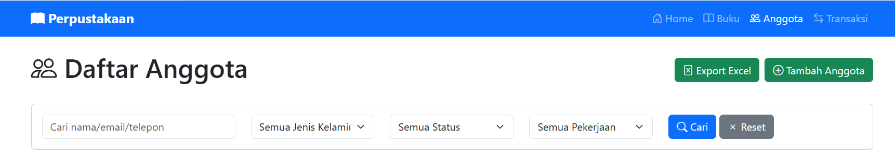

# Sistem Manajemen Perpustakaan (Laravel)

Project ini merupakan aplikasi **Sistem Manajemen Perpustakaan** berbasis Laravel yang digunakan untuk mengelola data anggota, buku, serta fitur export dan pencarian data.

- Nama: Najwa Armia Zahra
- NIM: 60324002
  
---

## Fitur Utama

### Tugas 1 - Auto Generate Kode Anggota (30%)
- Kode anggota otomatis dengan format:
  AGT-[TAHUN]-[NOMOR_URUT] : AGT-2026-001
- Reset nomor otomatis setiap tahun
  
  

---

### Tugas 2 - Export Data Anggota ke Excel (40%)
- Export data anggota ke file Excel
- Menggunakan package: maatwebsite/excel
- File hasil export:
  anggota_YYYY-MM-DD_HHMMSS.xlsx

  
  
  
  
  
  
  
  
  

---

### Tugas 3 - Advanced Search & Filter (30%)
- Pencarian berdasarkan:
- Nama
- Email
- Telepon
- Filter berdasarkan:
- Jenis kelamin
- Status anggota
- Pekerjaan
- Statistik anggota otomatis mengikuti hasil filter

---
